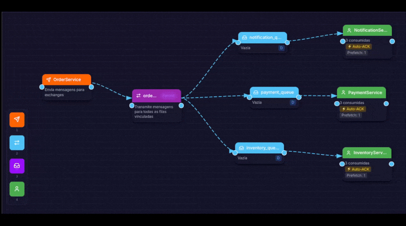

# Toy RabbitMQ Node Project

A small project for testing asynchronous messaging using `Node.js`, `TypeScript`, `Express`, and `RabbitMQ`.

This project implements a **Fanout Exchange pattern** to broadcast events to multiple services simultaneously, following **SOLID** principles and **Clean Architecture**.

## Message Flow



> Simulator: https://rmq.racoelho.com.br/

## How to Run

#### 1. Start RabbitMQ (Infrastructure)

```sh
npm run docker:up
```

> Ensure Docker is running and start the RabbitMQ broker

> Access the Management UI at: http://localhost:15672 (User/Pass: guest / guest)

#### 2. Start the Consumers (Workers)

```sh
npm run start:workers
```

#### 3. Start the API (Producer)

```sh
npm run start:server
```

## Testing the Flow

```sh
### New order
POST http://localhost:3000/orders
Content-Type: application/json

{
    "customer": "Customer X",
    "items": ["Node.js + RabbitMQ"],
    "total": 250.00
}
```

> Optional: Use `tests/api.http` file with `RestClient` plugin

## Project Structure

```
.
├── src
│   ├── config         # Configuration files
│   ├── domain         # Contracts and Entities (Logic)
│   ├── infra          # Technical implementations (RabbitMQ, Logging)
│   ├── services       # Business logic for Producer and Consumers
│   ├── server.ts      # API Entry point
│   └── consumers.ts   # Worker Entry point
└── tests              # Test scripts and .http files
```

## Available Scripts

- `npm run docker:up`: Starts RabbitMQ container.
- `npm run docker:down`: Stops and removes the container.
- `npm run start:server`: Starts the API with hot-reload.
- `npm run start:workers`: Starts Workers with hot-reload.
- `npm run build`: Compiles TypeScript to JavaScript in /dist.
